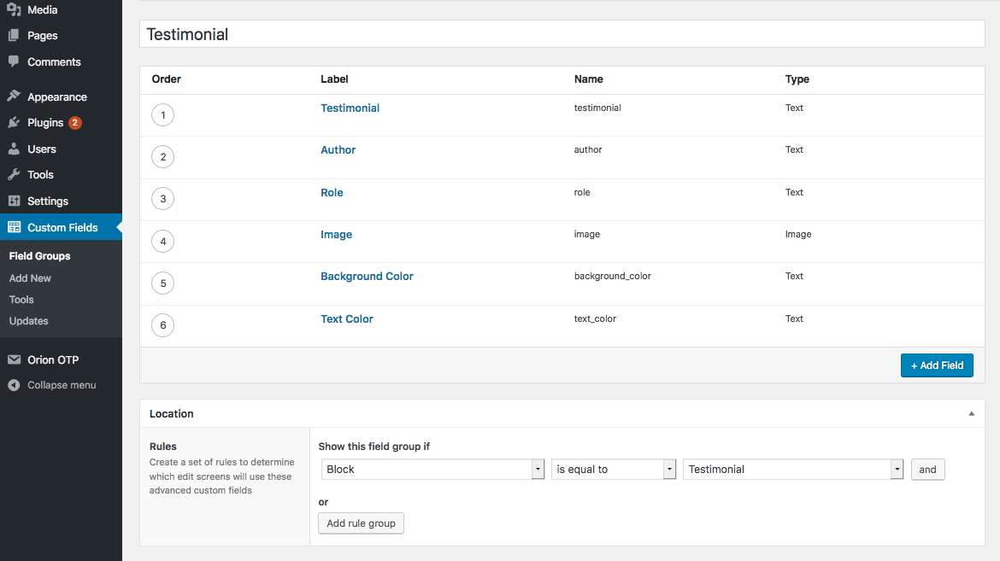
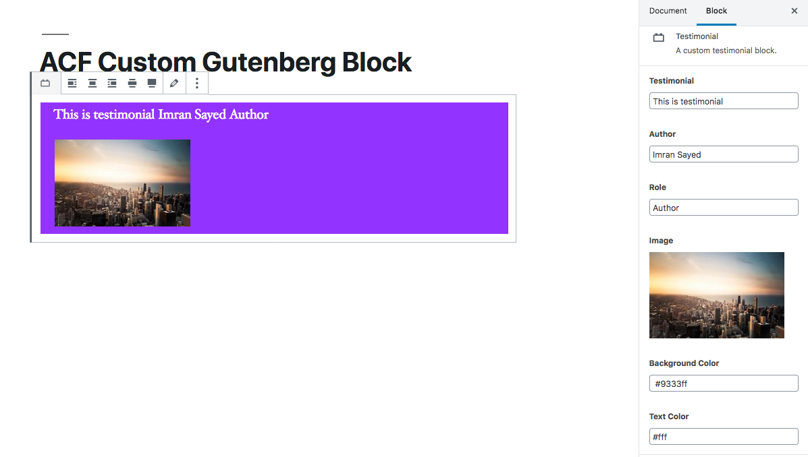

# ACF Guten Blocks

> This plugin creates Gutenberg blocks using ACF

## Getting Started :clipboard:

These instructions will get you a copy of the project up and running on your local machine for development purposes.

## Prerequisites :door:

You need to have any WordPress theme activated on your WordPress project, which has [ACF Pro](https://www.advancedcustomfields.com/pro/) Plugin installed and activated.

## Installation :wrench:

1. Clone the plugin directory in the `/wp-content/plugins/` directory, or install a zipped directory of this plugin through the WordPress plugins screen directly ( also remove the -master from the plugin directory )
2. Activate the plugin through the 'Plugins' screen in WordPress

## Use :ski:

1. Click on `Custom Fields` menu item on WordPress dashboard.
2. Create a new Field group called  `Testimonial` and add below fields
- Testimonial ( type: text )
- Author ( type: text )
- Role ( type: text )
- Image ( type: image )
- Background Color ( type: text )
- Text Color ( type: text )

2. Add a new post and select the block called `Testimonial`
3. Add the values from the of the above custom fields using control panel on the right. 
4. Now you will be able to see the content of your block template written in php inside the block.

You can also add the values of custom field by clicking on the inspector control edit icon, in the block. 

## Contributing :busts_in_silhouette:

Please read [CONTRIBUTING.md](https://gist.github.com/PurpleBooth/b24679402957c63ec426) for details on our code of conduct, and the process for submitting pull requests to us.

## Versioning

I use [Git](https://github.com/) for versioning. 

## Author :pencil:

* **[Imran Sayed](https://codeytek.com)**

## License :page_facing_up:

- **[GPLv2](https://www.gnu.org/licenses/old-licenses/gpl-2.0.en.html)**
